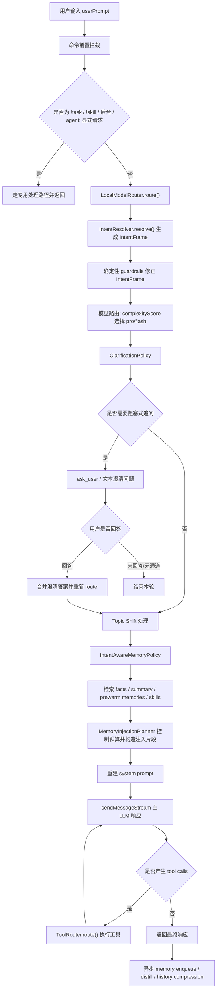

# Jarvis 意图理解到最终响应全链路

本文档说明 Jarvis 在收到一条用户输入后，如何逐层理解意图、选择模型、决定是否追问、决定是否注入记忆、构造上下文、执行工具，并最终返回响应。

重点覆盖当前 Intent Understanding 层的实际实现，而不是未来路线图。

## 0. 总览

一次普通消息的主路径在 `JarvisAgent.processMessage()` 中完成。核心流程如下：



主路径对应的核心文件：

- `jarvis/src/core/agent.ts`
- `jarvis/src/core/localModelRouter.ts`
- `jarvis/src/core/intentResolver.ts`
- `jarvis/src/core/clarificationPolicy.ts`
- `jarvis/src/core/intentAwareMemoryPolicy.ts`
- `jarvis/src/core/memoryInjectionPlanner.ts`
- `jarvis/src/core/toolRouter.ts`

## 1. 第一层：输入前置拦截

Jarvis 并不是所有输入都先交给 LLM。`processMessage()` 前面有几类快速路径。

### 1.1 `!clear`

`!clear` 会压缩或清空当前会话历史：

- 如果有 summarizer，则把历史压缩为摘要；
- 清掉 raw chat history；
- 保留 `conversationSummary` 供后续 summary chunk 检索；
- 不进入 intent routing。

### 1.2 `!task`

`!task` 命令直接交给 `TaskCommandHandler`。

这类请求不需要 LLM，也不需要 memory injection。

### 1.3 `!skill`

`!skill` 命令直接交给 `SkillCommandHandler`。

### 1.4 后台任务前缀

如果输入形如：

- `后台: ...`
- `background: ...`
- `async: ...`
- `bg: ...`

会进入 `BackgroundTaskRunner`，立即返回后台任务已启动，本轮主 LLM 不继续执行。

### 1.5 显式 `agent:`

如果输入以 `agent:` 开头，Jarvis 会绕过普通 LLM 路径，调用 `LocalModelRouter.routeAgentCall()` 做显式 agent routing。

这一点和“自然语言推荐候选 agent”不同：

- `agent:` 是用户明确要求启动 agent；
- 普通输入里的 `candidateAgents` 只是 intent 结果里的建议，不等于自动委派。

## 2. 第二层：LocalModelRouter

普通输入进入 `LocalModelRouter.route(userPrompt, history)`。

它做两件事：

1. 调用 `IntentResolver` 生成完整 `IntentFrame`；
2. 根据 `complexityScore` 选择实际主模型。

输出结构是 `RoutingResult`：

```ts
type RoutingResult = {
  model: string;
  score: number;
  classifierReason: string;
  decision: string;
  source: "local-router/ollama" | "local-router/fallback";
  querySubject: "personal" | "external" | "mixed";
  timeWindowDays: number | null;
  dateFrom: string | null;
  dateTo: string | null;
  resolvedDateRange: { from: number; to: number } | null;
  topicShifted: boolean;
  intent: IntentFrame | null;
};
```

如果本地模型失败、超时、JSON 无法修复，router 会 fallback：

- `model = proModel`
- `querySubject = mixed`
- `intent = null`

这里的 fallback 是保守策略：宁可使用强模型和 mixed subject，也不要把可能需要个人上下文的请求误判成 external。

## 3. 第三层：IntentResolver

`IntentResolver` 是当前意图理解层的核心。它不是简单分类器，而是“本地模型 + schema 归一化 + focused extractors + deterministic guardrails”的组合。

### 3.1 本地模型生成 IntentFrame seed

本地 Ollama 模型被要求输出一个 raw JSON object。它要同时判断：

- `query_subject`
- `task_type`
- `needs_external_knowledge`
- `needs_tool`
- `needs_scheduling`
- `candidate_agents`
- `confidence`
- `confidence_by_dimension`
- `semantic_evidence`
- `rich_intent`
- 时间窗口和 topic shift

这里本地模型不是直接控制执行，而是产出一个候选结构。

### 3.2 IntentFrame 的核心字段

当前标准化后的 `IntentFrame` 大致分为几组。

#### 请求主体

```ts
subject: "personal" | "external" | "mixed";
```

含义：

- `personal`：主要依赖用户历史、偏好、过去对话、长期记忆；
- `external`：纯外部世界问题，不依赖用户个人上下文；
- `mixed`：同时需要个人上下文和外部知识。

这个字段会影响 memory injection，是最关键字段之一。

#### 任务类型

```ts
taskType:
  | "chat"
  | "recall"
  | "analyze"
  | "execute"
  | "delegate"
  | "schedule";
```

含义：

- `chat`：普通对话回答；
- `recall`：回忆过去对话或用户记忆；
- `analyze`：分析、比较、判断、推荐；
- `execute`：修改文件、运行命令、完成操作；
- `delegate`：委派给专门 agent；
- `schedule`：提醒、定时、周期任务。

#### 能力需求

```ts
needsMemory: boolean;
needsExternalKnowledge: boolean;
needsTool: boolean;
needsScheduling: boolean;
```

这些字段给下游 policy 使用。

例如：

- `needsMemory=false` 会使 intent-aware memory policy 跳过 facts/summary/prewarm；
- `needsScheduling=true` 会让 clarification policy 更关注时间是否明确；
- `needsTool=true` 表示主 LLM 可能需要工具执行。

#### 时间范围

```ts
timeWindowDays: number | null;
dateFrom: string | null;
dateTo: string | null;
resolvedDateRange: { from: number; to: number } | null;
```

用于类似：

- 昨天我们聊了什么；
- 上周讨论过什么；
- 4 月 9 日的记录。

`resolvedDateRange` 优先级最高，因为它是代码侧解析出来的精确时间范围。

#### topic shift

```ts
topicShifted: boolean;
referencesRecentHistory: boolean;
topicAnalysis: {
  history: {
    label: string;
    evidence: string[];
    sourceTurns: number[];
    confidence: number;
  };
  current: {
    label: string;
    evidence: string[];
    sourceTurns: number[];
    confidence: number;
  };
  relation:
    | "same_topic"
    | "subtopic"
    | "adjacent_topic"
    | "new_topic"
    | "current_context_reference"
    | "unknown";
  relationReason: string;
  confidence: number;
  lowGrounding: boolean;
}
```

用于判断是否清空当前 chat history。

关键规则：

- 如果用户明确引用当前上下文，比如“继续”“这个”“刚才那个”，不能清空历史；
- 如果是新主题，且不是第一轮，可以清空历史，降低旧话题污染。
- `history.label` 和 `current.label` 是模型对最近历史和当前请求的短标签；
- `evidence` 是支撑标签的证据片段，优先来自原始用户输入或最近 history；
- 如果模型漏掉 evidence，normalize 层会用当前 prompt 或相关 history turn 做 fallback；
- `relation` 比自由文本 topic label 更重要，下游优先看关系类型和 `referencesRecentHistory`。

#### 分维度置信度

```ts
confidenceByDimension: {
  subject: number;
  taskType: number;
  memoryTarget: number;
  action: number;
  entityHints: number;
  topicShift: number;
  richIntent: number;
}
```

这是后续 guardrails 的基础。Jarvis 不只看 overall confidence，而是按维度处理。

例如：

- `memoryTarget` 低置信度：禁用 aggressive memory prewarm，必要时追问；
- `action` 低置信度：执行类任务先追问；
- `subject` 低置信度：更保守地按 mixed 处理。

#### semanticEvidence

```ts
semanticEvidence: {
  personalContext: {
    present: boolean;
    reason: string;
    span?: string;
  };
  memoryRecall: {
    present: boolean;
    target:
      | "conversation_history"
      | "user_memory"
      | "external_past_event"
      | "current_context_reference"
      | "none";
    reason: string;
    span?: string;
  };
  actionRequest: {
    present: boolean;
    action:
      | "read"
      | "write"
      | "run"
      | "schedule"
      | "delegate"
      | "none";
    object?: string;
  };
  entityHints: {
    tickers: string[];
    technicalTerms: string[];
    peopleOrCompanies: string[];
  };
};
```

这部分解决了单纯关键词判断容易误伤的问题。

例如：

- “上次苹果发布会发布了什么”应是 `external_past_event`，不是个人记忆召回；
- “你记得保存这个文件吗”不是 memory recall；
- “分析 ONNX 的基本面”不能因为 ONNX 是大写词就当股票 ticker；
- “结合我的风险偏好分析 NVDA”是 mixed，不是 external。

#### richIntent

```ts
richIntent: {
  userGoal: string;
  primaryAction:
    | "answer"
    | "recall"
    | "analyze"
    | "modify"
    | "run"
    | "schedule"
    | "delegate";
  targets: Array<{
    type:
      | "memory"
      | "file"
      | "code"
      | "external_entity"
      | "agent"
      | "calendar"
      | "current_context";
    value: string;
  }>;
  contextDependency: {
    recentConversation: boolean;
    longTermMemory: boolean;
    localWorkspace: boolean;
    externalWorld: boolean;
  };
  ambiguity: Array<{
    field: string;
    reason: string;
    severity: "low" | "medium" | "high";
  }>;
  riskLevel: "low" | "medium" | "high";
};
```

这是从“分类标签”升级到“结构化用户目标”的关键。

下游现在主要用它做：

- clarification policy；
- memory injection policy；
- prewarm query 构造；
- 判断是否依赖长期记忆、当前上下文、本地 workspace、外部世界。

### 3.3 JSON 解析与修复

本地小模型可能输出非法 JSON。当前流程是：

1. 从文本中提取看起来像 JSON object 的片段；
2. 用 predicate 判断是否符合 intent 结果形状；
3. 如果失败，调用一次 repair prompt；
4. repair 成功则继续 normalize；
5. repair 失败则抛错，由 `LocalModelRouter` fallback。

这让 Jarvis 可以使用较小本地模型，同时把 schema 风险控制在意图层内部。

### 3.4 Focused Extractors

主 intent JSON 之后，还可能按需调用更小范围的 focused extractor。

当前主要有两类：

- memory target extractor；
- entity hints extractor。

它们不是并发跑，而是按需、顺序执行，避免本地模型压力过大。

#### memory target extractor

用于修正“是否在问记忆，以及问哪类记忆”。

典型修正：

- `external_past_event`：外部过去事件，不应升级为 personal；
- `conversation_history`：问我们之前聊过什么；
- `current_context_reference`：指代当前对话；
- `user_memory`：问用户长期事实、偏好、历史。

#### entity hints extractor

用于区分股票 ticker 和技术缩写。

例如：

- `NVDA` 可以是 ticker；
- `ONNX`、`RAG`、`API`、`LLM` 应更多进入 technicalTerms；
- 不再单纯依赖 `/\b[A-Z]{2,5}\b/` 这种宽泛正则。

### 3.5 Deterministic Guardrails

模型输出不是最终真理。`IntentResolver` 后续会用代码规则修正高风险误判。

关键 guardrails 包括：

#### personal cue

如果请求含有明显个人上下文：

- “结合我”
- “适合我”
- “按我的”
- “for me”
- “based on my”

则 external 可升级为 mixed。

#### recall cue

如果明确问过去对话或 Jarvis 记忆：

- “我们之前聊过”
- “你上次说”
- “what did we discuss”

则可升级为 personal。

但这条被保护：

- `external_past_event` 不会因为“上次”被升级为 personal；
- `remember to save` 这类动作不是 memory recall。

#### low-confidence external

如果模型给了 external，但 subject confidence 低，则保守升级为 mixed。

原因：把需要用户上下文的请求误判成 external，会导致不注入记忆，损失更大。

#### action cue

如果用户明显要求执行：

- “帮我改”
- “运行测试”
- “实现”
- “提交”

则 taskType 可从 chat/analyze 修正为 execute。

#### schedule cue

如果用户明显要求提醒或周期任务：

- “提醒我”
- “每天”
- “每周”
- `remind me`
- `schedule`

则 taskType 可修正为 schedule。

#### delegate cue

只有显式 delegate/agent cue 才强推 delegation。

普通“分析 NVDA”可以添加 `investment-analysis` 到 candidateAgents，但不等于立即 delegate。

## 4. 第四层：模型选择

`LocalModelRouter` 使用 `complexityScore` 选择本轮主模型：

```ts
model = score >= threshold ? proModel : flashModel;
```

配置位于：

```json
{
  "routing": {
    "enabled": true,
    "model": "gemma4:e2b",
    "threshold": 70,
    "proModel": "gemini-2.5-pro",
    "flashModel": "gemini-3.1-flash-lite"
  }
}
```

这里有两个模型概念：

- `routing.model`：本地 Ollama intent 模型；
- `proModel/flashModel`：真正回答用户的主 LLM。

如果本地 intent 模型失败，默认使用 `proModel`。

## 5. 第五层：Clarification Policy

`ClarificationPolicy` 位于 local routing 之后、memory injection 之前。

它的目标不是“低置信就问”，而是判断：

> 继续执行的风险是否高于追问成本。

### 5.1 输入

```ts
type ClarificationPolicyInput = {
  userPrompt: string;
  intent: IntentFrame | null;
  querySubject: QuerySubject;
  candidateAgents: string[];
  recentHistoryLength?: number;
};
```

### 5.2 输出

```ts
type ClarificationDecision = {
  shouldAsk: boolean;
  blocking: boolean;
  questions: AskUserQuestion[];
  reasons: string[];
};
```

当前版本只实现 blocking clarification。

也就是说：

- 需要追问时，先停下来；
- 有交互通道时等待用户回答；
- 没有通道时输出澄清问题并结束本轮；
- 用户回答后，把答案合并进 prompt，并重新跑一次 intent routing。

重新 routing 很关键，因为澄清答案可能改变：

- subject；
- taskType；
- memory target；
- action；
- time range；
- model selection。

### 5.3 触发条件

#### 高风险执行不明确

如果满足：

- `taskType` 是 `execute` / `delegate` / `schedule`；
- 或 `riskLevel=high`；
- 且 action 或 target 不明确；

则追问。

例：

> 帮我处理一下这个文件

Jarvis 不应猜“处理”是格式化、删除、提交还是运行测试。

#### delegate agent 不明确

如果：

- `taskType=delegate`；
- 多个 candidate agents 都合理；
- action confidence 不够高或 target 不明确；

则让用户选 agent。

#### schedule 时间不明确

如果：

- `taskType=schedule`；
- 没有 `resolvedDateRange`；
- 也没有 `timeWindowDays`；

则追问具体时间。

#### memory target 不明确

如果：

- `querySubject` 不是 external；
- `needsMemory=true`；
- `memoryTarget` 置信度低或 ambiguity 指向 memory/context；

则追问：

- 当前对话；
- 长期记忆；
- 都不需要。

#### 当前上下文指代缺失

如果：

- `referencesRecentHistory=true`；
- `memoryRecall.target=current_context_reference`；
- 但近期 history 为空；

则追问用户“这个/刚才/继续”具体指什么。

### 5.4 可观测性开关

配置：

```json
{
  "routing": {
    "clarificationObservability": true
  }
}
```

开启后会输出结构化 trace：

```text
[clarification] {"enabled":true,"shouldAsk":false,...}
```

包含：

- shouldAsk / blocking；
- reasons；
- questionHeaders；
- intent subject/taskType/confidence；
- confidenceByDimension；
- memoryTarget；
- riskLevel；
- ambiguity；
- input querySubject/candidateAgents/recentHistoryLength。

默认值是 `false`，避免日志过多。

## 6. 第六层：Topic Shift

clarification 之后，Jarvis 才处理 topic shift。

原因：

- 如果需要追问，不能先清空 history；
- 用户回答澄清问题后会重新 route，topic shift 应基于最新 result 判断。

当前逻辑：

- `result.topicShifted=true`
- 当前不是第一轮；
- `routing.topicShiftDetection !== false`

则清空当前 chat history。

但如果用户是“继续”“这个”“刚才那个”等当前上下文引用，guardrails 会把 `topicShifted` 强制为 false。

### 6.1 Grounded Topic Analysis

Topic analysis 已从简单的：

```json
{
  "history_topic": "Procurement Agent architecture",
  "new_topic": "LLM reliability and Agent decision-making"
}
```

升级为 evidence-grounded 结构：

```json
{
  "topic_analysis": {
    "history": {
      "label": "AI Agent in Procurement",
      "evidence": ["AI Agent在企业采购流程中的优势与必要性？"],
      "source_turns": [-2],
      "confidence": 0.95
    },
    "current": {
      "label": "LLM Reliability and Agent Decision-Making",
      "evidence": ["LLM可靠性对Agent决策有什么影响？"],
      "source_turns": [0],
      "confidence": 0.95
    },
    "relation": "new_topic",
    "relation_reason": "same broad AI-agent domain, but different focus",
    "confidence": 0.95
  }
}
```

这解决的是 topic label 漂移问题：模型不能只自由生成一个话题名，还要给出支撑它的证据。

代码层还有几个通用保护：

- `referencesRecentHistory=true` 时，`relation` 强制为 `current_context_reference`；
- 没有 relation 但有 recent history 时，默认回退到 `adjacent_topic`，避免不可解释的 unknown；
- 如果 evidence 缺失，会用当前 prompt 或对应 history turn 作为 grounding fallback；
- `lowGrounding=true` 会降低 `topicShift` 维度置信度，提醒后续策略保守处理。

## 7. 第七层：Intent-Aware Memory Policy

`refreshContext()` 会先调用 `buildIntentAwareMemoryPolicy()`。

这一步决定三类记忆是否允许进入本轮上下文：

- facts；
- summary；
- prewarm vector memories。

### 7.1 输出

```ts
type IntentAwareMemoryPolicy = {
  querySubject: QuerySubject;
  allowFacts: boolean;
  allowSummary: boolean;
  allowPrewarm: boolean;
  factQuery: string;
  prewarmQuery: string;
  shouldRewritePrewarmQuery: boolean;
  prewarmLimit: number;
  prewarmMaxDistance: number;
  reasons: string[];
};
```

### 7.2 默认逻辑

如果没有 `IntentFrame`，退回旧逻辑：

- `external` 不注入；
- `personal/mixed` 注入。

如果有 `IntentFrame`，以 `intent.needsMemory` 为基础。

### 7.3 强约束

#### `external`

纯 external 请求默认不注入个人 facts、summary、prewarm memories。

例：

> 太阳系有哪些行星？

不需要用户记忆。

#### `external_past_event`

例：

> 上次苹果发布会发布了什么？

这是外部历史事件，不是“我们上次聊过什么”。因此：

- 不查 facts；
- 不查 summary；
- 不查 prewarm memories。

#### `current_context_reference`

例：

> 继续这个方案

这是当前上下文引用，不急着查长期记忆。因此：

- 不查 facts；
- 不查 summary；
- 不查 prewarm memories；
- 主要依赖 chat history。

#### tool task without memory dependency

如果是 execute/delegate/schedule，且 `richIntent.contextDependency.longTermMemory=false`，则不注入长期记忆。

例：

> 运行当前测试

不应注入用户偏好或历史对话。

#### 低置信 memory/subject

如果 `subject` 或 `memoryTarget` 置信度低：

- 禁用 summary；
- 禁用 prewarm；
- facts 仍可在 `needsMemory=true` 时保留。

这是为了减少语义检索带来的上下文污染。

### 7.4 查询构造

`prewarmQuery` 会把以下信息合并：

- 原始用户输入；
- `richIntent.targets`;
- entity hints。

这样像 “结合我的风险偏好分析 NVDA” 会把 `NVDA` 作为检索线索保留下来。

`factQuery` 在 personal/mixed 时会加前缀：

```text
PRIVATE_USER_DATA: User Query - ...
```

这是为了让 fact retrieval 更偏向用户私有事实。

## 8. 第八层：上下文检索

`refreshContext()` 继续执行实际检索。

### 8.1 Facts

当 `memoryPolicy.allowFacts=true`：

```ts
memoryService.searchFacts(memoryPolicy.factQuery);
```

返回结构化长期事实，例如偏好、身份、项目设定等。

### 8.2 Skills

如果可用 skills 数量超过配置上限：

- 优先走 `memoryService.searchSkills(userPrompt, limit, maxDistance)`；
- 如果 skill index 正在构建，回退注入完整 skill list；
- 如果没有相关 skill，注入空列表。

这一层和 intent memory policy 相对独立，主要控制技能说明是否进入 system prompt。

### 8.3 Prewarm Memories

当 `memoryPolicy.allowPrewarm=true`：

1. 取 `memoryPolicy.prewarmQuery`；
2. 如果 `routing.queryRewrite=true` 且 policy 允许，则调用本地模型重写 memory query；
3. 调用 `memoryService.searchWithScore()`；
4. 按 score/margin/reranker 规则过滤；
5. 产出 `PrewarmCandidate[]`。

非 reranker 模式下还有 top-1 信心保护：

- top1 score 太低：不注入；
- top1 和 top2 margin 太小：只注入 top1。

reranker 开启时，使用 `reranker.memoryRelevanceThreshold` 过滤。

### 8.4 Summary Chunks

当 `memoryPolicy.allowSummary=true` 且存在 `conversationSummary`：

1. 先查 summary chunk vector index；
2. 如果查不到，再用 fallback 从全文 summary 中抽相关段落。

`current_context_reference` 和 `external_past_event` 会禁用 summary 注入。

## 9. 第九层：MemoryInjectionPlanner

检索到候选项后，不会直接全部塞进 prompt，而是交给 `MemoryInjectionPlanner`。

它控制：

- 总字符预算；
- facts 字符预算；
- summary 字符预算；
- prewarm 字符预算；
- 单条 item 最大长度；
- personal/mixed 下不同 item 数量限制。

### 9.1 external 二次保护

如果 `querySubject=external`，planner 会拒绝所有：

- facts；
- summary；
- prewarm memories。

这是一道二次保险。即使前面 policy 某处失误，planner 仍能避免 external 请求注入个人记忆。

### 9.2 mixed 更保守

mixed 查询比 personal 更容易污染上下文，因此：

- fact items 更少；
- summary items 更少；
- prewarm items 更少；
- prewarm distance 更严格。

### 9.3 输出

```ts
type MemoryInjectionPlan = {
  facts: FactCandidate[];
  relevantSummarySection: string;
  prewarmSection: string;
  factsInjected: number;
  summaryInjected: number;
  prewarmInjected: number;
  usedChars: number;
  rejected: MemoryInjectionRejectedItem[];
};
```

最终 `refreshContext()` 用它重建 system prompt：

```text
Jarvis preamble
+ facts protocol
+ relevant summary section
+ prewarm section
```

## 10. 第十层：主 LLM 响应循环

系统 prompt 刷新后，Jarvis 调用：

```ts
client.sendMessageStream(currentQueryParts, abortSignal, promptId);
```

主 LLM 会流式返回：

- `Content`；
- `ToolCallRequest`；
- `Error`；
- `ModelInfo`。

Jarvis 会：

- 把 content 实时 emit 给 UI/channel；
- 收集 tool calls；
- 过滤 `ModelInfo`，避免模型名出现在聊天输出；
- 遇到 tool calls 时进入工具执行循环。

### 10.1 工具循环保护

有两类安全限制：

- `maxToolIterations`：防止无限工具循环；
- `maxConsecutiveToolFailures`：防止连续失败还继续重试。

网络错误则按 `network.maxRetries` 指数退避重试。

如果所有网络重试失败，可按配置清理 orphaned user turn。

## 11. 第十一层：ToolRouter

工具调用由 `ToolRouter.route()` 处理。

它把工具分成两类：

- Jarvis native tools；
- Gemini/Scheduler 标准工具。

### 11.1 Jarvis native tools

当前 native tools 包括：

- `save_memory`
- `recall_memory`
- `ask_user`
- `push_to_channel`
- `task_*`
- `run_evolved_skill_*`

#### save_memory

保存用户明确要求记住的信息。

重要性计算是确定性的 two-factor：

- category base score；
- remember intent score。

它不使用 distiller 的 LLM score，因为 tool call 本身缺少完整内容分析信号。

#### recall_memory

主动查询长期记忆。

它会使用 router 推断出的时间窗口作为 fallback：

- 如果 LLM 没传 `time_window_days`，用 `currentTimeWindowDays`；
- 如果 LLM 没传 `date_from/date_to`，用 `currentDateRange`；
- 如果 query 为空，从当前 user prompt 派生关键词。

这让“昨天我们讨论了什么”这类请求能正确约束时间范围。

#### ask_user

这是主 LLM 工具层的追问能力，和 clarification policy 的前置追问不同。

区别：

- ClarificationPolicy：LLM 响应前，基于 IntentFrame 做前置追问；
- ask_user tool：主 LLM 在执行过程中主动调用工具追问。

如果有 WebSocket handler，则等待用户输入；否则会 auto-select recommended options。

#### task\_\*

交给 `TaskCommandHandler`，用于任务增删改查和触发。

#### push_to_channel

通过 `ChannelRegistry` 推送到 Feishu/WeChat 等渠道。

### 11.2 标准工具

非 native tools 交给 Gemini scheduler。

特殊逻辑：

如果工具是 `generalist` 或 `codebase_investigator`，Jarvis 会给 request 额外注入：

- `searchFacts(query)`；
- `search(query, 3)`。

这是 subagent memory injection，目前还不完全受 P3 的 intent-aware memory policy 控制，需要后续继续收敛。

## 12. 第十二层：响应结束后的异步善后

主循环结束后，如果本轮不是纯 task tools，Jarvis 会异步做三件事。

### 12.1 会话记忆入队

```ts
memoryService.enqueue(sessionId, userPrompt, finalAssistantText);
```

用于后续向量记忆、会话记录等。

### 12.2 BackgroundDistiller

如果启用 distiller，会从用户输入和助手输出中提炼持久事实。

它重点避免把助手自己编出来的内容当成用户事实。

### 12.3 history compression

如果内存中的 chat history 超过阈值，会压缩为 summary，并只保留最近若干 raw turns。

压缩后的 summary 也会进入 summary chunk index，供后续 memory policy 允许时检索。

## 13. 关键场景决策表

| 用户请求                    | subject                 | taskType     | memory target             | 主要行为                                                |
| --------------------------- | ----------------------- | ------------ | ------------------------- | ------------------------------------------------------- |
| `太阳系有哪些行星`          | external                | chat/analyze | none                      | 不注入个人记忆，直接回答                                |
| `上次苹果发布会发布了什么`  | external                | analyze      | external_past_event       | 不注入个人记忆，避免误当 personal recall                |
| `我们之前聊过 ONNX 部署吗`  | personal                | recall       | conversation_history      | 允许记忆检索，并可用时间窗口                            |
| `你记得保存这个文件吗`      | external/mixed 视上下文 | execute/chat | none                      | 不因“记得”触发 memory recall                            |
| `继续刚才那个方案`          | personal                | chat/execute | current_context_reference | 不查长期记忆，依赖当前 history                          |
| `结合我的风险偏好分析 NVDA` | mixed                   | analyze      | user_memory/none          | 注入受限个人上下文和外部实体线索                        |
| `分析 ONNX 的基本面`        | external                | analyze      | none                      | ONNX 作为技术词，不自动添加投资 agent                   |
| `分析 NVDA 的基本面`        | external/mixed          | analyze      | none/user_memory          | 可添加 investment-analysis candidate，但不强制 delegate |
| `帮我处理一下这个文件`      | external/mixed          | execute      | none/current_context      | 高风险且动作不清，先追问                                |
| `提醒我复盘投资组合`        | mixed/external          | schedule     | none/user_memory          | 没有明确时间则先追问                                    |

## 14. 当前设计的边界

### 14.1 IntentFrame 是决策输入，不是最终答案

IntentFrame 只决定路由、追问、上下文注入、工具 fallback 参数。最终回答仍由主 LLM 生成。

### 14.2 规则不是为了替代 LLM

deterministic guardrails 只处理高频、高风险、可明确编码的失败模式。

例如：

- “上次发布会”不是 personal recall；
- “remember to save” 不是 memory recall；
- 技术缩写不是股票 ticker；
- 执行动作不明确时先追问。

LLM 负责开放语义理解，代码负责安全边界和一致性。

### 14.3 ClarificationPolicy 当前是 blocking-only

当前版本只支持前置阻塞式追问。

还没有实现：

- 多轮 clarification state machine；
- non-blocking advisory clarification；
- 自动提出默认方案并让用户确认。

### 14.4 Subagent memory injection 仍需收敛

`ToolRouter` 里对 `generalist` / `codebase_investigator` 的 memory injection 仍是工具层独立逻辑。

它还没有完全复用 `IntentAwareMemoryPolicy`，后续可以把 subagent request 也纳入同一套 policy。

### 14.5 外部知识仍依赖主模型或工具能力

`needsExternalKnowledge=true` 目前主要影响 intent 表达和后续规划，不等于一定会自动搜索互联网。

是否搜索外部世界仍取决于主模型工具调用和运行环境能力。

## 15. 如何调试一次意图理解

建议按以下顺序看日志。

### 15.1 Local routing 日志

```text
🔀 [Jarvis] Local routing: ...
```

关注：

- selected model；
- subject；
- topic_shifted；
- time_window；
- classifier reason；
- source。

### 15.2 Clarification trace

开启：

```json
{
  "routing": {
    "clarificationObservability": true
  }
}
```

查看：

```text
[clarification] {...}
```

关注：

- `shouldAsk`;
- `reasons`;
- `confidenceByDimension`;
- `ambiguity`;
- `memoryTarget`;
- `riskLevel`。

### 15.3 Intent-aware memory policy 日志

```text
🔍 [Jarvis] Intent-aware memory policy — skipping facts (...)
🧠 [prewarm] disabled by intent-aware policy (...)
🧠 [summary] disabled by intent-aware policy (...)
```

关注：

- 是否因为 external/current_context/external_past_event 禁用了记忆；
- mixed 是否使用更严格的 limit/distance；
- low confidence 是否禁用了 summary/prewarm。

### 15.4 MemoryInjectionPlanner 日志

```text
🧠 [MemoryInjectionPlanner] candidates(...) → injected(...)
```

关注：

- 候选数量；
- 实际注入数量；
- rejected reason；
- used chars。

### 15.5 ToolRouter 日志

```text
🧠 [Jarvis] Active Recall initiated ...
❓ [Jarvis] ask_user ...
📅 [Jarvis] Task tool invoked ...
```

关注：

- recall_memory 是否使用了 router fallback 时间范围；
- ask_user 是前置 clarification 还是 LLM 工具中途追问；
- task tools 是否导致跳过 memory distill。

## 16. 一句话总结

当前 Jarvis 的意图理解层已经不是“让 LLM 自己看着办”，而是分成了四层：

1. 本地模型输出结构化 `IntentFrame`；
2. deterministic guardrails 修正高风险误判；
3. clarification / memory policy 把 intent 变成可执行决策；
4. 主 LLM 在被约束过的上下文和工具环境里完成最终响应。

这个架构的关键价值是：LLM 负责语义弹性，代码负责可解释性、一致性和安全边界。
