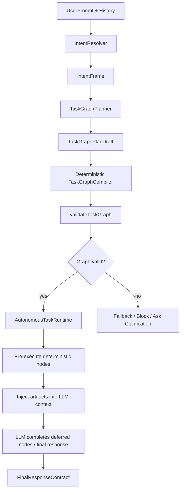

# TaskGraph Planner 终态架构设计

本文档描述 Jarvis TaskGraph 从当前“`intentSteps` 到节点的规则映射”演进到
“模型辅助工作流规划 + 确定性执行编译”的目标架构。

核心目标不是修补某几个失败 case，而是提升 TaskGraph 作为任务编译器的整体质量：

- 从完整用户请求中识别真实工作流，而不是逐个 `IntentStep` 猜 node kind；
- 把自然语言任务转换成可验证、可执行、可恢复的 runtime contract；
- 允许本地模型参与高层规划，但不让模型直接决定危险执行细节；
- 让 TaskGraph 的质量可以被 eval、日志和 acceptance contract 持续衡量。

## 1. 当前问题

当前主链路大致是：

```text
IntentResolver
→ IntentFrame.intentSteps
→ nodeKindForStep()
→ TaskGraph
→ deterministic pre-execution
→ LLM final response
```

这个结构在简单任务上有效，例如 recall、schedule、明确的 write_file。但它有一个结构性限制：

`intentSteps` 是语义分解，不等同于可执行工作流。

例如用户请求：

```text
在某个目录下是最近一段时间对美国市场的预测、分析和复盘。
以这些文档作参考，结合你对美国市场的认识，完成一篇有深度的分析，保存在本地文档中。
```

语义分解可能得到：

```text
analyze local_file_analysis
analyze analysis_generation
save final_document
```

但真正可执行的工作流应该是：

```text
discover local directory
read many documents
extract evidence and prior theses
compare forecast/review accuracy
generate original analysis
write local document
```

如果直接把 `intentSteps` 映射成节点，就容易得到纯 LLM 图：

```text
analyze → analyze → respond
```

这张图没有 `read_file`、`read_many_files`、`write_file` 等 deterministic 节点，因此 TaskGraph
runtime 会正确地跳过预执行，但用户期望的本地读取和落盘没有被 runtime contract 捕获。

## 2. 设计原则

TaskGraph Planner 的终态应遵循以下原则。

### 2.1 Intent 理解和任务规划分层

`IntentResolver` 回答“用户想要什么”：

- subject / memory target；
- task type；
- rich intent；
- context dependency；
- risk level；
- semantic evidence；
- intent steps。

`TaskGraphPlanner` 回答“完成这件事需要怎样的工作流”：

- source acquisition；
- local workspace discovery；
- evidence extraction；
- synthesis / analysis；
- artifact writing；
- schedule / push / delegate；
- human confirmation gates。

这两层不能混为一谈。Intent 是语义契约，TaskGraph 是执行契约。

### 2.2 本地模型做高层规划，不直接生成最终执行图

本地模型适合判断开放语义，例如：

- 用户提到的目录是不是任务输入源；
- “作参考”是否意味着需要读取资料；
- “保存到本地文档”是否意味着必须落盘；
- 一个任务是否包含收集、分析、写作、发送等多阶段工作流。

但本地模型不适合直接决定最终执行细节，例如：

- tool call 参数；
- shell 命令；
- acceptance criteria；
- retry policy；
- policy gate；
- final response contract。

因此模型输出应该是受控的 workflow draft，而不是最终 `TaskGraph`。

### 2.3 确定性 compiler 负责安全和一致性

模型输出的 workflow draft 必须经过确定性编译：

```text
TaskGraphPlanDraft
→ normalize
→ policy gate
→ compile to TaskGraph nodes/edges
→ validateTaskGraph()
→ execution decision
```

compiler 负责：

- 将高层 workflow step 映射为 runtime node kind；
- 推导 capabilities；
- 建立依赖边；
- 生成 outputs；
- 生成 acceptance criteria；
- 应用 memory/workspace/security/channel policy；
- 在缺少必要输入时阻塞或降级；
- 生成 final response contract。

### 2.4 模型建议只在 validator 通过后生效

所有模型建议都必须满足：

- kind 在白名单内；
- path hint 必须来自用户输入、当前上下文或已知 artifact；
- 写文件必须有明确内容来源或上游生成节点；
- shell / network / push / schedule 必须通过对应 policy；
- high-risk action 必须满足确认策略；
- graph 不得出现循环依赖；
- required capability 必须可用。

模型可以提升规划覆盖率，但不能绕过 runtime 安全边界。

## 3. 目标链路

目标链路如下：

```text
UserPrompt
→ IntentResolver.resolve()
→ TaskGraphPlanner.planWorkflow()
→ TaskGraphCompiler.compile()
→ validateTaskGraph()
→ AutonomousTaskRuntime pre-exec deterministic nodes
→ LLM loop completes deferred reasoning/generation
→ final response contract verifies claim scope
```

用 Mermaid 表示：



## 4. TaskGraphPlanDraft DSL

Planner 输出一个高层 DSL，表达“工作流意图”，不表达底层 tool call。

建议初始类型：

```ts
export type TaskGraphPlanDraft = {
  goal: string;
  confidence: number;
  assumptions: string[];
  steps: TaskGraphPlanDraftStep[];
};

export type TaskGraphPlanDraftStep = {
  id: string;
  kind:
    | "source_acquisition"
    | "local_workspace_discovery"
    | "local_file_read"
    | "evidence_extraction"
    | "analysis"
    | "artifact_write"
    | "memory_recall"
    | "schedule"
    | "channel_push"
    | "delegate"
    | "final_response";
  purpose: string;
  source?: {
    type:
      | "user_prompt"
      | "local_file"
      | "local_directory"
      | "current_context"
      | "memory"
      | "web"
      | "tool_result";
    pathHint?: string;
    queryHint?: string;
  };
  artifact?: {
    type:
      | "message"
      | "report"
      | "file"
      | "source"
      | "memory"
      | "scheduled_task";
    format?: "markdown" | "json" | "text" | "html";
    destinationHint?: string;
  };
  dependsOn: string[];
  required: boolean;
  riskLevel: "low" | "medium" | "high";
};
```

示例：

```json
{
  "goal": "基于本地美国市场预测文档生成深度分析并保存",
  "confidence": 0.86,
  "assumptions": [
    "用户提供的目录是主要参考资料来源",
    "最终结果需要写入本地文档"
  ],
  "steps": [
    {
      "id": "draft-1",
      "kind": "local_workspace_discovery",
      "purpose": "发现目录中的可读文档",
      "source": {
        "type": "local_directory",
        "pathHint": "/Users/lw/Documents/投资/美国市场预测"
      },
      "dependsOn": [],
      "required": true,
      "riskLevel": "low"
    },
    {
      "id": "draft-2",
      "kind": "local_file_read",
      "purpose": "读取预测、分析和复盘文档",
      "source": {
        "type": "local_directory",
        "pathHint": "/Users/lw/Documents/投资/美国市场预测"
      },
      "dependsOn": ["draft-1"],
      "required": true,
      "riskLevel": "low"
    },
    {
      "id": "draft-3",
      "kind": "evidence_extraction",
      "purpose": "提取历史观点、预测依据和复盘结论",
      "dependsOn": ["draft-2"],
      "required": true,
      "riskLevel": "low"
    },
    {
      "id": "draft-4",
      "kind": "analysis",
      "purpose": "结合美国市场认知形成独到分析",
      "dependsOn": ["draft-3"],
      "required": true,
      "riskLevel": "medium"
    },
    {
      "id": "draft-5",
      "kind": "artifact_write",
      "purpose": "保存最终分析文档",
      "artifact": {
        "type": "file",
        "format": "markdown",
        "destinationHint": "local_file"
      },
      "dependsOn": ["draft-4"],
      "required": true,
      "riskLevel": "low"
    }
  ]
}
```

## 5. Compiler 映射规则

`TaskGraphCompiler` 将 draft step 编译为 runtime node。

建议映射：

| Draft kind                  | TaskGraph node                       | Capability          | 说明                 |
| --------------------------- | ------------------------------------ | ------------------- | -------------------- |
| `memory_recall`             | `recall`                             | `memory.recall`     | 走 MemoryRuntime     |
| `source_acquisition` + web  | `research`                           | `web.search`        | 外部资料搜索         |
| `local_workspace_discovery` | `read_file` 或新增 `list_directory`  | `file.read`         | 目录发现             |
| `local_file_read`           | `read_file` 或新增 `read_many_files` | `file.read`         | 文件/目录读取        |
| `evidence_extraction`       | `analyze`                            | `llm.analyze`       | 从材料提取结构化证据 |
| `analysis`                  | `analyze`                            | `llm.analyze`       | 综合分析             |
| `artifact_write`            | `write_file`                         | `file.write`        | 落盘                 |
| `schedule`                  | `schedule`                           | `task.schedule`     | 提醒/定时任务        |
| `channel_push`              | `push`                               | `channel.push`      | 推送                 |
| `delegate`                  | `delegate`                           | `subagent.delegate` | 委派                 |
| `final_response`            | `respond`                            | `llm.respond`       | 最终回答             |

长期建议扩展 TaskGraph node kind：

- `list_directory`
- `read_many_files`
- `extract_evidence`
- `write_artifact`

短期可以先把目录读取编译为现有工具组合：

```text
read_file node with directory path
→ adapter 内部转为 glob/read_many_files
```

或：

```text
run_shell find/cat
```

但后者安全边界更重，不应作为默认方案。

## 6. Planner 调用策略

不要每次都无条件调用本地模型。建议使用混合策略。

### 6.1 直接 deterministic compile 的场景

以下任务可以继续走现有快速路径：

- 明确 recall；
- 明确 schedule；
- 明确单文件读写；
- 明确 push；
- 简单 chat / answer；
- 低复杂度且 intentSteps 已能生成完整 deterministic graph。

### 6.2 触发 TaskGraphPlanner 的场景

出现以下信号时调用本地模型 planner：

- prompt 中存在本地路径或目录路径，但 graph 没有 file read 节点；
- prompt 中存在“参考这些文档/资料/内容”，但 graph 没有 source acquisition；
- prompt 中存在“保存/输出/落地/写成文档”，但 graph 没有 write node；
- taskType 是 `execute` 或 richIntent 指向 workspace，但 graph 全是 analyze/respond；
- intentSteps 数量大于 1 且包含 source、analysis、artifact 等混合语义；
- graph validator 发现缺少 required artifact producer；
- task graph 只有 LLM nodes，但 user goal 明确要求工具效果。

### 6.3 Repair 而不是替换

Planner 可用于两种模式：

```text
draft-first:
  IntentFrame → PlannerDraft → Compiler → TaskGraph

repair:
  IntentFrame → ExistingGraph → GapDetector → PlannerDraftRepair → CompilerPatch → TaskGraph
```

初期推荐 repair 模式，风险更低：

- 保留当前已经稳定的 recall/schedule/research 路径；
- 只在明显 graph gap 时补强；
- 日志中对比原始图和修复图；
- 方便做 A/B eval。

## 7. Prompt 设计边界

Planner prompt 应要求模型：

- 只输出 JSON；
- 只使用允许的 draft kind；
- 不生成 shell 命令；
- 不编造不存在的路径；
- pathHint 只能来自用户输入或上下文；
- 不决定具体文件名时使用 destinationHint；
- 不做安全豁免；
- 不输出最终 TaskGraph schema；
- 对不确定项写入 assumptions。

推荐 prompt 目标：

```text
You are compiling a user request into a high-level workflow draft.
Do not produce tool calls.
Do not invent paths.
Prefer explicit user-provided inputs.
Represent required work as source acquisition, local file read, analysis,
artifact write, schedule, push, delegate, or final response steps.
```

## 8. Validation 和安全边界

Planner 输出进入 runtime 前必须通过以下检查。

结构检查：

- JSON 可解析；
- step id 唯一；
- kind 合法；
- dependsOn 指向已有 step；
- 无循环依赖；
- required 字段完整。

来源检查：

- 本地 path 必须来自用户 prompt、currentContent、artifact 或显式配置；
- web query 必须来自用户目标或上下文；
- memory recall 必须符合 memory boundary；
- write destination 不明确时只能写入默认安全目录或请求澄清。

能力检查：

- required capability 可用；
- channel 可用；
- shell/network policy 允许；
- file write policy 允许；
- high-risk step 需要确认。

合同检查：

- 每个 required artifact 必须有 producer；
- write_file 必须依赖 content-producing node；
- final response 不能 claim 未完成 required node；
- partial execution 必须生成 incomplete contract。

## 9. Observability

需要新增日志维度：

```text
[TaskGraphPlanner] mode=deterministic|model|repair
[TaskGraphPlanner] trigger=local_path_without_read,...
[TaskGraphPlanner] draft steps=...
[TaskGraphPlanner] rejected reason=...
[TaskGraphCompiler] compiled nodes=...
[TaskGraphCompiler] acceptance=...
[TaskGraphGapDetector] gaps=...
```

建议诊断 artifact：

```json
{
  "prompt": "...",
  "intent": {...},
  "originalGraph": {...},
  "plannerDraft": {...},
  "compiledGraph": {...},
  "gaps": [...],
  "rejections": [...],
  "finalDecision": "compiled"
}
```

这类日志应支持写入 JSONL，便于后续 eval 和人工审查。

## 10. Eval 指标

TaskGraph 质量不能只看最终回答，需要单独评估 graph。

建议指标：

- node coverage：是否包含必需节点；
- edge correctness：依赖是否正确；
- artifact producer coverage：每个 required artifact 是否有 producer；
- capability correctness：capabilities 是否匹配任务；
- acceptance criteria quality：是否能验证用户目标；
- pre-execution usefulness：是否产生对最终回答有用的 artifact；
- claim safety：最终回答是否只 claim 已完成内容；
- over-execution rate：是否不该执行却执行；
- under-execution rate：应执行但未执行；
- planner repair acceptance rate；
- model draft rejection rate。

示例 eval case：

```json
{
  "prompt": "读取 /tmp/reports 下的复盘文档，写一篇总结并保存成 markdown",
  "expectedRequiredNodeKinds": ["read_file", "analyze", "write_file"],
  "expectedArtifacts": ["source", "report", "file"],
  "forbiddenNodeKinds": ["push", "schedule"],
  "mustHaveEdges": [
    ["read_file", "analyze"],
    ["analyze", "write_file"]
  ]
}
```

## 11. 渐进落地路线

每个阶段都必须有可执行的验证门控。门控分四类：

- 静态门控：类型检查、schema validation、边界检查；
- 单元门控：针对 planner/compiler/gap detector 的确定性测试；
- eval 门控：面向任务图质量的样例集；
- 运行时门控：日志、shadow mode、fallback、回滚条件。

任何阶段如果不能被自动验证，就只能作为实验开关进入，不应成为默认路径。

### Phase 1：Graph Gap Detector

先不引入模型，新增 gap detector：

- local path without read；
- save request without write；
- source reference without source acquisition；
- execute task with only LLM nodes；
- required artifact without producer。

输出日志，不改变行为。

交付产物：

- `taskGraphGapDetector.ts`；
- gap 类型枚举；
- `detectTaskGraphGaps(intent, graph, context)`；
- JSONL 诊断输出；
- graph quality eval case schema 初版。

自动门控：

- 单元测试覆盖每一种 gap；
- 对无 gap 的 recall、schedule、simple answer、明确 write_file case 断言零误报；
- 对典型失败样例断言能检测出 gap：
  - 本地目录参考但没有 read；
  - 保存本地文档但没有 write；
  - execute 任务只有 analyze/respond；
  - expected file artifact 没有 producer；
- `validateTaskGraph()` 行为不变；
- legacy graph 输出完全不被修改。

eval 门控：

- 新增至少 30 个 graph-gap eval cases；
- gap detector 对 high-confidence positive cases recall >= 0.9；
- false positive rate <= 0.1，尤其不能把普通聊天、recall、schedule 错报为需要文件/写入；
- 每个 gap case 必须包含 `expectedGaps` 和 `forbiddenGaps`。

运行时门控：

- 默认 `shadow`，只打日志，不改变 TaskGraph；
- 日志必须包含 original graph node kinds、gap ids、trigger evidence；
- gap 日志不得包含大段文件内容，只记录路径/摘要/节点类型；
- 出现异常时吞掉 detector 错误，继续使用 legacy graph。

通过标准：

- 所有单元测试通过；
- graph-gap eval 达到阈值；
- 在本地真实对话 shadow 运行一段时间后，没有发现 recall/schedule 等稳定路径被误判为危险 gap；
- 日志足以解释每个 gap 的触发依据。

回滚条件：

- 发现高频误报影响日志可读性；
- detector 异常影响正常 TaskGraph build；
- gap id 不稳定导致 eval 难以维护。

### Phase 2：Deterministic Repair

对高置信 gap 做确定性修复：

- 插入 local file read；
- 插入 write_file；
- 建立 analyze/write 依赖；
- 修正 acceptance criteria。

这一步可以解决大量明显问题，并为 planner 提供 baseline。

交付产物：

- `taskGraphRepair.ts` 或 compiler patch 模块；
- `repairTaskGraphGaps(intent, graph, gaps, context)`；
- repair diff 诊断；
- 修复后的 graph 再次进入 `validateTaskGraph()`；
- 配置开关：`planner.mode = "shadow" | "repair" | "off"`。

自动门控：

- 每个 repair rule 都有单元测试；
- repair 后 graph 必须无循环；
- repair 后 required capabilities 必须存在；
- repair 不能删除 legacy graph 中已有 required node；
- repair 不能新增 push/schedule/shell/destructive action；
- write_file repair 必须依赖 content-producing node；
- file read repair 的 path 必须来自用户输入或明确 runtime context；
- repair 后 acceptance criteria 必须从 `response_contains` 升级为更具体的 `file_exists`、`tool_result` 或 source/evidence criteria。

eval 门控：

- 在 Phase 1 的 30 个 graph-gap cases 上，high-confidence repair pass rate >= 0.8；
- 原有 taskGraph tests 必须全部通过；
- 新增 regression suite：
  - local directory reference -> read/analyze/write；
  - single file summarize -> read/analyze/respond or write；
  - save markdown -> write_file；
  - external research + save -> research/analyze/write；
  - schedule/recall 不被插入 file nodes；
- over-repair rate <= 0.05。

运行时门控：

- 初期默认 shadow：同时生成 repaired graph，但仍执行 legacy graph；
- shadow 日志输出 legacy vs repaired 的 node/edge/acceptance diff；
- repair 执行开关按会话或配置启用；
- repair 失败必须 fallback 到 legacy graph；
- final response contract 必须保留 partial execution 约束，不能因为 repair 后有 write 节点就允许提前 claim success。

通过标准：

- shadow diff 经人工抽查，修复方向正确；
- repair graph 在 eval 中提升 node coverage，且不显著增加 over-execution；
- 对目标失败样例，execution decision 从 `no_deterministic_nodes` 变为存在可执行 read/write/research 节点；
- runtime artifact 能注入最终 LLM context。

回滚条件：

- repair 产生危险执行节点；
- repair 使原本可执行 graph 变成 blocked；
- repair 引入错误依赖，导致 write 早于 analyze；
- repair 后 acceptance criteria 无法通过，造成大量 false failure。

### Phase 3：Model-Assisted Planner Draft

只在 gap detector 触发时调用本地模型：

- 生成 workflow draft；
- compiler 编译；
- validator 审核；
- 失败时回退到 deterministic graph；
- 记录 draft/rejection。

交付产物：

- `taskGraphPlannerModelClient.ts`；
- planner prompt；
- `TaskGraphPlanDraft` schema；
- draft parser / repair / validator；
- draft rejection reason；
- model-assisted repair shadow mode。

自动门控：

- planner draft schema 使用运行时 validator；
- 非法 JSON、未知 kind、循环 dependsOn、编造 path、缺 required 字段必须被拒绝；
- model draft 不能直接生成 tool args、shell command、absolute output path 除非来自用户输入；
- draft 只能作为 compiler input，不能绕过 compiler；
- compiler 必须能从 draft 生成合法 TaskGraph 或明确 rejection；
- 模型超时、空响应、非法响应都必须 fallback。

eval 门控：

- 建立 `taskGraphPlannerDraft` eval suite，至少覆盖：
  - local documents -> read/evidence/analysis/write；
  - web research -> research/analysis/respond；
  - current context -> analyze/write；
  - recall + analysis -> recall/analyze/respond；
  - schedule with missing time -> blocked clarification；
  - push without channel -> blocked；
- draft exact shape 不要求完全一致，但 required workflow kind coverage >= 0.85；
- forbidden workflow kind violation <= 0.05；
- model draft rejection reason 必须可统计；
- 与 deterministic repair baseline 对比，至少在 mixed workflow cases 上有可见提升。

运行时门控：

- 默认只在 gap detector 触发时调用；
- 默认 shadow，不影响执行；
- 支持 per-session 开关；
- 记录 prompt hash、model、latency、draft step kinds、rejection reason；
- 超时预算必须小于主 LLM 请求预算，建议 30s 内；
- planner 失败不得影响 legacy graph；
- 连续失败达到阈值后自动熔断本会话 planner。

通过标准：

- planner 在 shadow eval 中显著提升复杂任务 workflow coverage；
- draft rejection 多数来自合理安全拒绝，而不是 schema 不稳定；
- 平均延迟可接受；
- 没有发现模型编造 path 后被 compiler 接受；
- fallback 路径被测试覆盖。

回滚条件：

- 模型输出 schema 不稳定导致 rejection rate 过高；
- latency 明显拖慢交互；
- 模型建议频繁引入 forbidden workflow；
- planner failure 泄漏到用户可见错误。

### Phase 4：Dedicated TaskGraph Compiler

把 `nodeKindForStep()` 逐步下沉为 compiler 的 fallback，而不是主路径。

目标主路径：

```text
IntentFrame
→ TaskGraphPlanDraft
→ TaskGraphCompiler
→ TaskGraph
```

交付产物：

- `taskGraphCompiler.ts`；
- legacy builder compatibility adapter；
- compiler acceptance criteria generator；
- compiler edge builder；
- compiler capability mapper；
- compiler policy gate；
- graph diff tooling。

自动门控：

- compiler 输出必须总是经过 `validateTaskGraph()`；
- 对同一 draft，compiler 输出必须 deterministic；
- compiler 不调用模型；
- compiler 必须为每个 required artifact 生成 producer 或 blocked reason；
- compiler 必须生成 final response contract 所需的 incomplete node 信息；
- legacy builder 和 compiler 在简单任务上保持等价：
  - recall；
  - schedule；
  - single write；
  - research；
  - respond。

eval 门控：

- graph quality suite 总通过率不低于 legacy；
- complex workflow suite 相比 legacy node coverage 提升；
- edge correctness >= 0.9；
- artifact producer coverage >= 0.9；
- forbidden node rate <= 0.03；
- acceptance criteria coverage >= 0.9。

运行时门控：

- `compilerMode = "legacy" | "shadow" | "compiler"`；
- shadow 同时生成 legacy graph 和 compiler graph，记录 diff；
- compiler graph 被拒绝时 fallback legacy；
- blocked reason 必须可解释；
- observability 能按 graph id 串起 draft、compiler、execution、final contract。

通过标准：

- shadow 对比显示 compiler 不降低稳定任务质量；
- compiler 能覆盖 planner draft 的主要 workflow；
- final response contract 与 execution result 一致；
- 关键 runtime 流程 recall/research/write/schedule 均有端到端测试。

回滚条件：

- compiler 破坏已有 recall/schedule/research 行为；
- graph diff 难以解释；
- compiler 和 execution adapter 对 node semantics 理解不一致；
- blocked graph 比例异常升高。

### Phase 5：扩展 Runtime Node

补足目录和多文件任务的一等能力：

- `list_directory`
- `read_many_files`
- `extract_evidence`
- `write_artifact`

避免用单文件读取或 shell 命令承担目录型任务。

交付产物：

- 新增 node kind：
  - `list_directory`；
  - `read_many_files`；
  - `extract_evidence`；
  - `write_artifact`；
- 对应 capability；
- 对应 adapter；
- 对应 acceptance criteria；
- toolRouter 支持目录列举和多文件读取；
- execution artifact schema 支持多文件摘要和 evidence bundle。

自动门控：

- node kind 必须有 capability mapping；
- node kind 必须有 adapter；
- node kind 必须有 acceptance criteria；
- 目录读取必须限制文件类型、数量、大小和路径来源；
- 多文件读取必须有 truncation / summarization 策略；
- `write_artifact` 必须区分 final content 和 intermediate evidence；
- 不能通过 shell 作为默认目录读取路径。

eval 门控：

- 多文件目录任务端到端通过；
- 大目录任务不会超出 token / latency 预算；
- 不支持文件类型能被明确跳过并记录；
- read_many_files artifacts 能被 LLM 正确消费；
- evidence extraction 输出能提升最终回答引用材料的准确性。

运行时门控：

- 默认最大文件数、最大总字符数、单文件最大字符数；
- 对用户 home 以外路径或敏感目录可配置阻塞；
- artifact 日志只记录路径和摘要，不记录完整敏感内容；
- 超预算时生成 partial artifact 和 incomplete contract；
- directory node 失败时不影响后续安全 fallback。

通过标准：

- 原始失败场景可以端到端完成：
  - 列出目录；
  - 读取多份文档；
  - 提取证据；
  - 生成分析；
  - 写入本地文档；
  - final response 可以 claim 文件已保存；
- runtime logs 能解释每个执行节点；
- final document 内容能追溯到输入 artifacts。

回滚条件：

- 目录读取误读敏感路径；
- 大文件导致上下文爆炸；
- evidence artifact 噪声过高，反而降低最终回答质量；
- write_artifact 和旧 write_file 语义冲突。

## 11.1 全阶段合并门控

每个阶段进入默认启用前，都必须满足以下共同门控：

- `npm`/`vitest` 对应测试通过；
- `runtime:check-boundaries` 通过；
- graph quality eval 报告归档；
- 新增配置有默认关闭或 shadow 模式；
- 所有 fallback 路径有测试；
- observability 能解释 planner/repair/compiler 的最终选择；
- 文档同步更新；
- 失败时不会阻塞 legacy graph。

建议 CI 增加独立任务：

```text
npm run test -- taskGraph
npx tsx scripts/run_task_graph_quality.ts --suite graph-planning
npm run runtime:check-boundaries
```

如果某阶段还不能满足自动门控，只能以实验配置存在，不能作为默认路径。

## 12. 代码落点建议

建议新增模块：

```text
packages/intent-runtime/src/taskGraphPlanner.ts
packages/intent-runtime/src/taskGraphCompiler.ts
packages/intent-runtime/src/taskGraphGapDetector.ts
packages/intent-runtime/src/taskGraphPlannerModelClient.ts
packages/intent-runtime/src/taskGraphPlanner.test.ts
packages/intent-runtime/src/taskGraphCompiler.test.ts
packages/intent-runtime/src/taskGraphGapDetector.test.ts
```

现有模块调整：

- `taskGraph.ts` 保留类型、validation、legacy builder；
- `buildTaskGraph()` 内部逐步切到 compiler；
- `jarvisTaskGraphRuntime.ts` 继续负责 adapter 和 execution decision；
- `configManager.ts` 增加 planner 开关；
- eval runner 增加 graph quality suite。

配置建议：

```json
{
  "agentRuntime": {
    "autonomousTaskRuntime": {
      "enabled": true,
      "mode": "execute",
      "planner": {
        "enabled": true,
        "mode": "repair",
        "provider": "ollama",
        "model": "gemma4:e2b",
        "timeoutMs": 30000,
        "observability": true
      }
    }
  }
}
```

## 13. 风险和取舍

主要风险：

- 本地模型规划不稳定；
- planner draft schema 增加复杂度；
- 编译层和现有 taskGraph builder 重叠；
- 目录读取、多文件读取会扩大执行面；
- eval 体系需要跟上，否则质量提升不可见。

对应控制：

- planner 初期只做 repair；
- draft suggestion 不通过 validator 就丢弃；
- 保留 legacy graph fallback；
- 所有新增执行节点必须有 acceptance criteria；
- high-risk / destructive action 继续走确认；
- 先打日志再改变行为。

## 14. 终态判断

TaskGraph 的终态不是一个更复杂的正则映射器，而是一个分层任务编译系统：

```text
IntentResolver:
  understand what the user wants

TaskGraphPlanner:
  design the workflow needed to satisfy it

TaskGraphCompiler:
  convert the workflow into executable, validated runtime nodes

AutonomousTaskRuntime:
  execute deterministic parts and produce artifacts/contracts

LLM loop:
  complete deferred reasoning and present the final result safely
```

这条路线允许 Jarvis 在复杂任务上形成更像“项目执行计划”的结构，同时保留 runtime 的安全性、
可解释性和可回归性。
