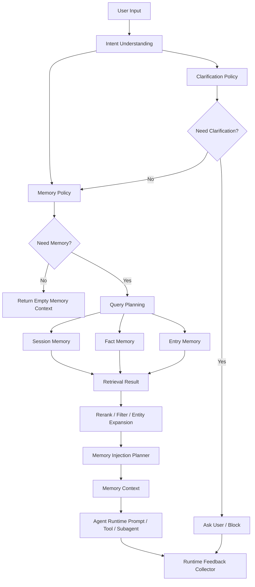

# Universal Memory Layer 设计草案

本文档定义从 Jarvis 当前实现中沉淀一个通用 Memory Runtime 的目标架构。

这个 Memory Runtime 不只是一个向量检索模块，而是一套完整的 agent 记忆层：

- 意图理解层：判断用户请求是否需要记忆、需要哪类记忆、是否存在边界风险；
- Session Memory：当前会话和近期上下文；
- Fact Memory：稳定用户事实、偏好、画像和长期 profile；
- Entry Memory：历史对话、任务、事件、决策和经验记录；
- Retrieval / Injection：检索、精排、预算控制、注入和拒绝理由；
- Eval / Feedback Loop：从真实使用中沉淀失败样本，持续回归。

## 1. 目标

Jarvis 当前构建在 Gemini CLI 运行时上，但最近增强的 intent understanding、memory policy、memory injection 和 eval 体系已经具备通用价值。

最终目标是把这些能力抽成一个可复用层，使其他 agent 项目可以在不继承 Jarvis/Gemini CLI runtime 的情况下复用：

- 稳定的意图理解；
- 可解释的 memory policy；
- 三层记忆模型；
- 可替换的模型、embedding、vector store 和 reranker adapter；
- 可回归的 eval / runtime feedback 机制。

这层的定位是：

```text
Application Agent Runtime
  uses
Universal Memory Layer
  uses
Model / Embedding / Vector / Storage Adapters
```

它不应该直接依赖 Gemini CLI、JarvisAgent、ToolRouter、具体 channel、具体 scheduler 或某个特定数据库实现。

## 2. 为什么要把 Intent Understanding 放进 Memory Layer

通用 memory 层不能只从“用户输入文本”直接检索记忆。原因是同一句话是否需要记忆，取决于意图。

例如：

| 用户输入                    | 正确判断       | Memory 行为                               |
| --------------------------- | -------------- | ----------------------------------------- |
| `上次苹果发布会发布了什么`  | 外部历史事件   | 不注入个人记忆                            |
| `我们上次聊过苹果发布会吗`  | 会话历史召回   | 检索 session / entry memory               |
| `结合我的风险偏好分析 NVDA` | mixed          | 注入受限 fact memory                      |
| `继续刚才那个方案`          | 当前上下文引用 | 优先 session history，不急于查长期 memory |
| `Javis，我是 David Liu`     | 用户事实陈述   | 更新 fact，不应误当作 recall              |

如果 memory 层没有 intent understanding，就只能靠关键词判断“上次”“之前”“记得”，会导致：

- external 请求误注入 personal memory；
- 当前上下文引用误查长期记忆；
- 用户事实更新误判成记忆召回；
- subagent/tool 层各自重新理解用户请求，边界不一致。

因此，Intent Understanding 是 Universal Memory Layer 的入口控制器。它负责把自然语言请求转换为稳定的 Memory Contract。

## 3. 总体架构



核心原则：

- LLM 负责开放语义理解；
- policy 负责确定性边界；
- memory policy 负责是否查、查什么、怎么查；
- injection planner 负责预算、排序和最终可注入内容；
- runtime feedback 负责把真实失败样本沉淀成 eval candidates。

## 4. 三层记忆模型

### 4.1 Session Memory

Session Memory 表示当前会话和近期上下文。

用途：

- 支持“继续刚才那个方案”“这个呢”“按上面的来”；
- 支持 topic continuity 和 topic shift 判断；
- 支持短期澄清答案合并；
- 支持当前会话摘要。

原因：

- session history 是最强的短期上下文，不应该和长期向量记忆混在一起；
- 当前上下文引用通常不需要查长期记忆，查错反而会污染回答；
- session 层可以保留更高保真的原始 turns，而长期 memory 应该更压缩、更稳定。

建议接口：

```ts
export type ConversationTurn = {
  role: "user" | "assistant";
  content: string;
  timestamp?: string;
};

export type SessionMemory = {
  scope: "session";
  sessionId: string;
  turns: ConversationTurn[];
  summary?: string;
  topicState?: TopicState;
};
```

### 4.2 Fact Memory

Fact Memory 表示稳定、可复用的用户事实和长期 profile。

用途：

- 用户偏好；
- 用户身份；
- 风险偏好；
- 长期项目背景；
- 明确保存的个人资料。

原因：

- fact 应该是经过 distill / validation 的稳定信息，不应该把每条对话原文都当 fact；
- fact 通常需要较高 precision，错注入会明显影响回答；
- fact 需要 confidence、sourceRefs、updatedAt，便于冲突处理和回溯。

建议接口：

```ts
export type FactMemory = {
  id: string;
  scope: "fact";
  subject: "user" | "preference" | "profile" | "project" | "relationship";
  content: string;
  confidence: number;
  sourceRefs: string[];
  createdAt: string;
  updatedAt: string;
};
```

### 4.3 Entry Memory

Entry Memory 表示历史对话、任务、事件、决策和经验记录。

用途：

- 召回“之前关于梓潼的讨论”；
- 召回历史任务执行过程；
- 召回某次决策背景；
- 支持按时间窗口检索；
- 支持 episodic memory。

原因：

- entry 比 fact 更接近历史事件，可能不是长期稳定事实；
- entry 需要时间、实体、来源和原文摘要；
- entry 可以承载“发生过什么”，fact 承载“稳定成立什么”。

建议接口：

```ts
export type EntryMemory = {
  id: string;
  scope: "entry";
  kind: "conversation" | "task" | "decision" | "event" | "reflection";
  content: string;
  entities: string[];
  timestamp: string;
  sourceRefs: string[];
};
```

## 5. Memory Contract

Intent Understanding 层应该输出一个对 memory 层稳定可消费的 contract。

当前 Jarvis 的 `IntentFrame` 已经包含这些信息：

- `subject`: `personal` / `external` / `mixed`
- `taskType`: `chat` / `recall` / `analyze` / `execute` / `delegate` / `schedule`
- `needsMemory`
- `semanticEvidence.memoryRecall.target`
- `referencesRecentHistory`
- `topicShifted`
- `confidenceByDimension`
- `richIntent.contextDependency`
- `intentSteps`
- `policyTrace`

通用层可以在此基础上收敛成更明确的 Memory Contract：

```ts
export type MemoryContract = {
  needMemory: boolean;
  subjectBoundary: "personal" | "external" | "mixed";
  targetScopes: Array<"session" | "fact" | "entry">;
  memoryTarget:
    | "none"
    | "current_context"
    | "conversation_history"
    | "user_profile"
    | "episodic_event"
    | "project_context";
  query: {
    raw: string;
    rewritten?: string;
    entities: string[];
    timeRange?: DateRange;
  };
  confidence: {
    subject: number;
    target: number;
    query: number;
  };
  constraints: {
    allowPersonalFacts: boolean;
    allowSessionHistory: boolean;
    allowEntries: boolean;
    maxChars: number;
  };
  reasons: string[];
  policyTrace: IntentPolicyTraceEntry[];
};
```

原因：

- `IntentFrame` 是完整意图表达，Memory Contract 是 memory 子系统的稳定入口；
- 这样 tool、subagent、main response 可以消费同一份 memory decision；
- 其他 agent 项目可以替换自己的 intent schema，但只要能生成 Memory Contract，就能复用 memory runtime。

## 6. 核心接口

### 6.1 Memory Runtime

```ts
export interface MemoryRuntime {
  understand(input: UserTurnInput): Promise<IntentFrame>;

  planMemory(input: {
    prompt: string;
    history: ConversationTurn[];
    intent: IntentFrame;
  }): Promise<MemoryContract>;

  retrieve(contract: MemoryContract): Promise<MemoryRetrievalResult>;

  inject(input: {
    prompt: string;
    intent: IntentFrame;
    contract: MemoryContract;
    retrieval: MemoryRetrievalResult;
    budget: TokenBudget;
  }): Promise<MemoryInjectionResult>;

  observe(event: MemoryRuntimeEvent): Promise<void>;
}
```

### 6.2 Adapter 边界

通用层不直接绑定具体模型或存储。

```ts
export interface IntentModelClient {
  generateJson(input: {
    system: string;
    prompt: string;
    temperature?: number;
  }): Promise<string>;
}

export interface EmbeddingClient {
  embed(text: string): Promise<number[]>;
}

export interface VectorStore<T> {
  search(input: {
    query: string;
    topK: number;
    filters?: Record<string, unknown>;
  }): Promise<Array<{ item: T; score: number }>>;
}

export interface Reranker {
  rerank<T>(input: {
    query: string;
    candidates: Array<{ item: T; text: string }>;
  }): Promise<Array<{ item: T; score: number }>>;
}
```

原因：

- 不同 agent 项目可能使用 OpenAI、Gemini、Ollama、vLLM 或云厂商模型；
- vector store 可能是 sqlite-vec、pgvector、Qdrant、Milvus、Pinecone；
- reranker 可能不存在，也可能是 cross-encoder、本地 ONNX 或 API；
- adapter 边界可以让 memory runtime 保持稳定。

## 7. Jarvis 当前实现映射

| 通用层能力           | Jarvis 当前实现                                            |
| -------------------- | ---------------------------------------------------------- |
| Intent Understanding | `jarvis/src/core/intentResolver.ts`                        |
| Policy Layer         | `jarvis/src/core/intentPolicy.ts`                          |
| Clarification        | `jarvis/src/core/clarificationPolicy.ts`                   |
| Memory Policy        | `jarvis/src/core/intentAwareMemoryPolicy.ts`               |
| Injection Planner    | `jarvis/src/core/memoryInjectionPlanner.ts`                |
| Session Recall       | `jarvis/src/core/conversationRecall.ts`                    |
| Intent Plan          | `jarvis/src/core/intentPlan.ts` / `intentExecutionPlan.ts` |
| Runtime Feedback     | `jarvis/src/core/runtimeIntentFeedbackCollector.ts`        |
| Runtime Integration  | `jarvis/src/core/agent.ts`                                 |
| Model Routing        | `jarvis/src/core/localModelRouter.ts`                      |
| Fact / Entry Storage | `MemoryService` 及其底层存储                               |

当前最有价值、也最应该先抽出的模块：

1. `IntentFrame` types；
2. `intentPolicy.ts`；
3. `clarificationPolicy.ts`；
4. `intentAwareMemoryPolicy.ts`；
5. `memoryInjectionPlanner.ts`；
6. `runtimeIntentFeedbackCollector.ts`。

## 8. 当前阻碍复用的耦合点

### 8.1 模型调用耦合

`intentResolver.ts` 当前直接依赖 `ollamaGenerate`。

应改为依赖 `IntentModelClient` adapter。Jarvis 可以提供 `OllamaIntentModelClient`，其他项目可以提供 OpenAI / Gemini / vLLM adapter。

### 8.2 ToolRouter 类型耦合

`clarificationPolicy.ts` 当前依赖 `toolRouter.ts` 的 `AskUserQuestion` 类型。

应把 question schema 移到通用 intent package 中，让 ToolRouter 反向消费它。

### 8.3 Jarvis 领域语义耦合

`candidateAgents`、`investment-analysis`、部分 skill / subagent 决策是 Jarvis 项目语义。

应拆成：

- 通用字段：subject、taskType、memoryTarget、risk、steps；
- 应用字段：candidateAgents、domain skills、project-specific routing hints。

### 8.4 Runtime 接入耦合

当前 memory planning、retrieval、prompt refresh、tool execution 编排仍在 `agent.ts`。

应通过 `MemoryRuntime` 暴露稳定接口，让 `agent.ts` 只负责调用，不直接承载 memory 决策逻辑。

## 9. 迁移路线

### Phase 1：边界文档和类型冻结

目标：

- 明确 Universal Memory Layer 的职责边界；
- 定义 Memory Contract；
- 列出 Jarvis 当前模块映射；
- 确认哪些字段是通用，哪些字段是 Jarvis-specific。

完成标准：

- 本文档存在并持续更新；
- `intent-understanding-flow.md` 链接到本文档；
- 后续代码改造不再扩大 Jarvis runtime 和 memory logic 的耦合。

### Phase 2：新增接口层，不移动实现

目标：

- 新增 `packages/memory-runtime` 或 `jarvis/src/memory-runtime`；
- 先放通用 types/interfaces；
- Jarvis 现有实现逐步引用这些类型；
- 不改变运行时行为。

建议目录：

```text
packages/memory-runtime/
  src/
    intent/
    policy/
    stores/
    retrieval/
    injection/
    feedback/
    adapters/
```

完成标准：

- `IntentModelClient`、`MemoryContract`、`MemoryRuntime` 类型稳定；
- `ClarificationQuestion` 从 ToolRouter 类型中解耦；
- 现有测试通过。

当前实现入口：

```text
jarvis/src/memory-runtime/
  adapters.ts
  runtime.ts
  types.ts
  index.ts
```

这一阶段只冻结通用契约，不迁移 resolver、policy、retrieval 或 injection 的具体实现。
Jarvis 现有运行路径保持不变。

### Phase 3：迁移纯逻辑模块

目标：

- 迁移 policy、clarification、memory policy、injection planner；
- 保持 Jarvis import 路径可兼容；
- 对每个迁移模块跑现有单测。

优先级：

1. `intentPolicy.ts`
2. `clarificationPolicy.ts`
3. `intentAwareMemoryPolicy.ts`
4. `memoryInjectionPlanner.ts`
5. `runtimeIntentFeedbackCollector.ts`

原因：

- 这些模块最接近纯逻辑；
- 对 Gemini CLI runtime 依赖少；
- 最适合作为通用层第一批资产。

当前实现状态：

- `intentPolicy.ts` 已迁移到 `jarvis/src/memory-runtime/intentPolicy.ts`；
- `clarificationPolicy.ts` 已迁移到 `jarvis/src/memory-runtime/clarificationPolicy.ts`；
- `intentAwareMemoryPolicy.ts` 已迁移到 `jarvis/src/memory-runtime/intentAwareMemoryPolicy.ts`；
- `memoryInjectionPlanner.ts` 已迁移到 `jarvis/src/memory-runtime/memoryInjectionPlanner.ts`；
- `jarvis/src/core/*` 保留兼容 re-export，现有 Jarvis import 路径不变。

### Phase 4：抽 IntentResolver adapter

目标：

- 把 `ollamaGenerate` 替换成 `IntentModelClient`；
- 把 focused extractors 也改为通过 model adapter 调用；
- 支持不同项目选择不同本地或远端模型。

完成标准：

- Jarvis 使用 Ollama adapter 行为不变；
- eval runner 可以切换多个 model client；
- resolver 不再直接 import `ollamaClient.ts`。

当前实现状态：

- `IntentResolver` 依赖通用 `IntentModelClient`；
- 默认 Jarvis 路径使用 `OllamaIntentModelClient`，行为保持为本地 Ollama；
- JSON repair、memory target extractor、entity hints extractor 和主 intent seed 都通过同一个 model adapter；
- `scripts/run_intent_evals.ts` 显式构造 `OllamaIntentModelClient` 后传入 resolver，为后续切换 OpenAI/Gemini/vLLM adapter 留出入口；
- `IntentResolver` 不再直接 import `ollamaClient.ts`。

### Phase 5：统一 main / tool / subagent memory policy

目标：

- main response、tool、subagent 都消费同一份 Memory Contract；
- external 请求不能在 subagent 层泄漏 personal memory；
- recall fallback 继承 router 的 time range 和 memory target；
- subagent prompt 显式携带 memory decision。

原因：

- 当前主路径已经 intent-aware，但 subagent/tool 层仍可能独立注入 memory；
- 这是从“Jarvis 内部优化”走向“通用 memory runtime”的关键边界。

当前实现状态：

- `IntentAwareMemoryPolicy` 现在同时产出 `MemoryContract`；
- main response path 仍通过 intent-aware policy 做 facts / summary / entry 检索和注入；
- `ToolRouter` 每轮接收同一份 `MemoryContract`；
- `generalist` / `codebase_investigator` subagent prompt 会显式携带 `<memory_decision>`；
- subagent 只有在 contract 允许时才检索 personal facts / entries；
- external / external_past_event / no-memory contract 会阻止 subagent personal memory 注入；
- `recall_memory` 在 contract 禁止 personal entries 时返回拒绝说明，不读取长期个人记忆；
- `recall_memory` 空 query fallback 优先使用 contract 的 rewritten query，并继续继承 router 的 time range / date range。

## 10. Eval 和反馈闭环

通用 memory 层必须内置 eval 思路，否则无法证明它比普通 RAG 更可靠。

至少需要四类 eval：

| Eval 类型          | 目标                                         |
| ------------------ | -------------------------------------------- |
| Intent eval        | subject/taskType/memoryTarget/steps 是否正确 |
| Memory policy eval | 是否该查 memory、查哪层 memory               |
| Retrieval eval     | 能否找回正确 fact/entry/session              |
| Injection eval     | 是否注入正确内容、拒绝错误内容               |

Runtime feedback 负责把真实使用样本沉淀成 candidate：

- router fallback；
- JSON repair / deterministic fallback；
- policy correction；
- low confidence dimension；
- clarification blocked；
- memory 注入错误；
- 用户显式纠错；
- tool/subagent memory 泄漏。

这些 candidate 需要人工 review 后进入稳定 eval cases，不能自动晋升。

## 11. 非目标

Universal Memory Layer 不应该负责：

- 具体 UI；
- 具体 channel，例如 WeChat、CLI、WebSocket；
- 具体 task scheduler；
- 具体 tool execution；
- 具体 Gemini CLI client；
- 业务领域 agent 的全部 prompt。

它只提供 memory 相关的理解、策略、检索、注入和反馈能力。

## 12. 当前结论

Jarvis 当前实现已经具备抽象出 Universal Memory Layer 的基础，但还没有达到开箱即用 package 的程度。

当前状态可以判断为：

- 作为参考实现：已经可用；
- 作为 Jarvis 内部子系统：基本成型；
- 作为其他 agent 项目的可复用库：需要完成 adapter 化和类型边界抽取；
- 作为通用开源 package：还需要迁移、文档、eval 和 API 稳定化。

下一步最实际的动作是 Phase 2：新增接口层，不移动实现，先冻结 Memory Contract 和 adapter 边界。
